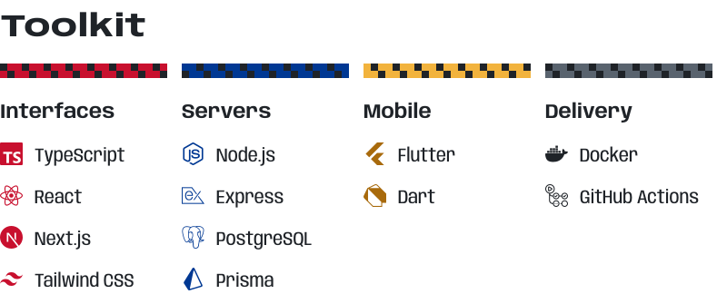
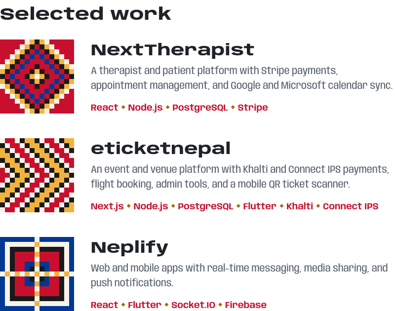
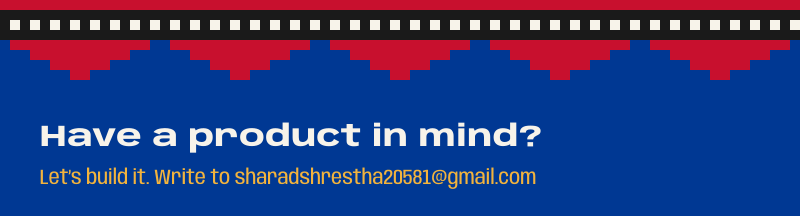

<a href="https://www.sharad-shrestha.com.np/"><picture><source media="(prefers-color-scheme: dark)" srcset="assets/link-portfolio-dark.svg"></picture></a>&nbsp;&nbsp;&nbsp;&nbsp;
<a href="https://www.linkedin.com/in/sharad-shrestha-1554211a3/"><picture><source media="(prefers-color-scheme: dark)" srcset="assets/link-linkedin-dark.svg"></picture></a>&nbsp;&nbsp;&nbsp;&nbsp;
<a href="mailto:sharadshrestha20581@gmail.com"><picture><source media="(prefers-color-scheme: dark)" srcset="assets/link-email-dark.svg"></picture></a>

I build web and mobile products end to end: the screens people use, the APIs behind them, and the databases underneath. I've spent 2+ years shipping production apps from Kathmandu.

 

<picture><source media="(prefers-color-scheme: dark)" srcset="assets/toolkit-dark.svg"></picture>

 

<picture><source media="(prefers-color-scheme: dark)" srcset="assets/work-dark.svg"></picture>

  

<!-- Pattern: Dhaka weave in the colours of the Nepal flag. Type: Anybody and Tiro Devanagari Hindi (SIL OFL). Icons: Simple Icons (CC0). -->
