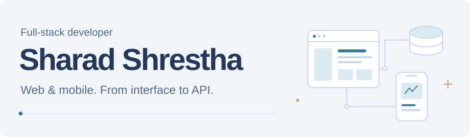

<picture>
  <source media="(prefers-color-scheme: dark)" srcset="assets/header-dark.svg" />
  <source media="(prefers-color-scheme: light)" srcset="assets/header-light.svg" />
  
</picture>

  <a href="https://www.sharad-shrestha.com.np/">Portfolio</a> &nbsp; / &nbsp;
  <a href="https://www.linkedin.com/in/sharad-shrestha-1554211a3/">LinkedIn</a> &nbsp; / &nbsp;
  <a href="https://x.com/sharadbaucha">X</a> &nbsp; / &nbsp;
  <a href="mailto:sharadshrestha20581@gmail.com">Email</a>

# Hi, I'm Sharad.

I'm a full-stack developer based in Kathmandu, Nepal, with 2+ years of experience building production web and mobile applications. I work across interfaces, APIs, and databases, with a focus on products that are straightforward to use and maintain.

## Selected work

### NextTherapist

A therapist and patient platform with Stripe payments, appointment management, and Google and Microsoft calendar synchronization.

React &nbsp; · &nbsp; Node.js &nbsp; · &nbsp; PostgreSQL &nbsp; · &nbsp; Stripe

### eticketnepal

An event and venue platform with Khalti and Connect IPS payments, flight booking, administration tools, and a mobile QR ticket scanner.

Next.js &nbsp; · &nbsp; Node.js &nbsp; · &nbsp; PostgreSQL &nbsp; · &nbsp; Flutter &nbsp; · &nbsp; Khalti &nbsp; · &nbsp; Connect IPS

### Neplify

Web and mobile applications with real-time messaging, media sharing, and push notifications.

React &nbsp; · &nbsp; Flutter &nbsp; · &nbsp; Socket.IO &nbsp; · &nbsp; Firebase

## Tools I work with

| Area | Stack |
| :--- | :--- |
| Web | TypeScript, React, Next.js, Tailwind CSS |
| Backend | Node.js, Express, PostgreSQL, Prisma |
| Mobile | Flutter, Dart |
| Delivery | Docker, GitHub Actions |

---

Have a product in mind? [Let's talk.](mailto:sharadshrestha20581@gmail.com)
