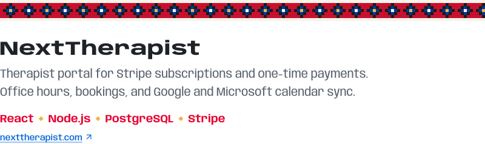
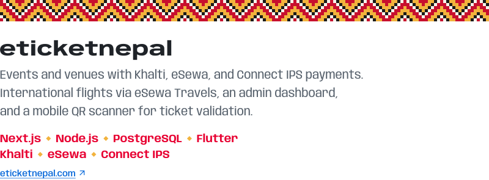
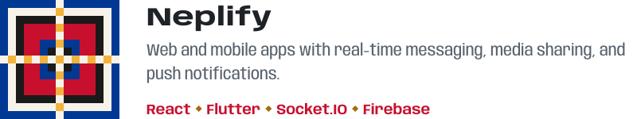

<a href="https://www.sharad-shrestha.com.np/"><picture><source media="(prefers-color-scheme: dark)" srcset="assets/link-portfolio-dark.svg"></picture></a>&nbsp;&nbsp;&nbsp;&nbsp;
<a href="https://www.linkedin.com/in/sharad-shrestha-1554211a3/"><picture><source media="(prefers-color-scheme: dark)" srcset="assets/link-linkedin-dark.svg"></picture></a>&nbsp;&nbsp;&nbsp;&nbsp;
<a href="https://x.com/sharadriitu"><picture><source media="(prefers-color-scheme: dark)" srcset="assets/link-x-dark.svg"></picture></a>&nbsp;&nbsp;&nbsp;&nbsp;
<a href="mailto:sharadshrestha20581@gmail.com"><picture><source media="(prefers-color-scheme: dark)" srcset="assets/link-email-dark.svg"></picture></a>

I build web and mobile products end to end with React, Next.js, Flutter, Node.js, and PostgreSQL. At Sahakarya Tech, I work on payment and calendar integrations, real-time chat, API and database performance, and deployments with GitHub Actions.

 

<picture><source media="(prefers-color-scheme: dark)" srcset="assets/toolkit-dark.svg"></picture>

 

<picture><source media="(prefers-color-scheme: dark)" srcset="assets/work-dark.svg"></picture>

<a href="https://nexttherapist.com/"><picture><source media="(prefers-color-scheme: dark)" srcset="assets/work-nexttherapist-dark.svg"></picture></a>

 

<a href="https://eticketnepal.com/"><picture><source media="(prefers-color-scheme: dark)" srcset="assets/work-eticketnepal-dark.svg"></picture></a>

 

<a href="https://neplify.com/"><picture><source media="(prefers-color-scheme: dark)" srcset="assets/work-neplify-dark.svg"></picture></a> 
<a href="https://neplify.com/"><picture><source media="(prefers-color-scheme: dark)" srcset="assets/work-neplify-website-dark.svg"></picture></a><a href="https://apps.apple.com/us/app/neplify/id6757994067"><picture><source media="(prefers-color-scheme: dark)" srcset="assets/work-neplify-app-store-dark.svg"></picture></a><a href="https://play.google.com/store/apps/details?id=com.neplify.neplify"><picture><source media="(prefers-color-scheme: dark)" srcset="assets/work-neplify-google-play-dark.svg"></picture></a>

  

<!-- Pattern: Dhaka weave in the colours of the Nepal flag. Type: Anybody and Tiro Devanagari Hindi (SIL OFL). Icons: Simple Icons (CC0). -->
