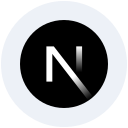
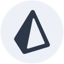

  
  
  

# Hi, I'm Sharad.

I'm a full-stack developer in Kathmandu, Nepal, with **2+ years of experience** building production web and mobile applications. I build interfaces, APIs, and the systems behind them.

## My toolkit

<table align="center">
  <tr>
    <td align="center" width="150"> TypeScript</td>
    <td align="center" width="150"> React</td>
    <td align="center" width="150"> Next.js</td>
    <td align="center" width="150"> Tailwind CSS</td>
  </tr>
  <tr>
    <td align="center" width="150"> Node.js</td>
    <td align="center" width="150"> Express</td>
    <td align="center" width="150"> PostgreSQL</td>
    <td align="center" width="150"> Prisma</td>
  </tr>
  <tr>
    <td align="center" width="150"> Flutter</td>
    <td align="center" width="150"> Dart</td>
    <td align="center" width="150"> Docker</td>
    <td align="center" width="150"> GitHub Actions</td>
  </tr>
</table>

## Selected work

A therapist and patient platform with Stripe payments, appointment management, and Google and Microsoft calendar synchronization.

`React` `Node.js` `PostgreSQL` `Stripe`

An event and venue platform with Khalti and Connect IPS payments, flight booking, administration tools, and a mobile QR ticket scanner.

`Next.js` `Node.js` `PostgreSQL` `Flutter` `Khalti` `Connect IPS`

Web and mobile applications with real-time messaging, media sharing, and push notifications.

`React` `Flutter` `Socket.IO` `Firebase`

---

  Have a product in mind? <a href="mailto:sharadshrestha20581@gmail.com"><strong>Let's build it.</strong></a>

<!-- Technology icons: Devicon v2.17.0. License included in assets/icons/LICENSE.devicon. -->
